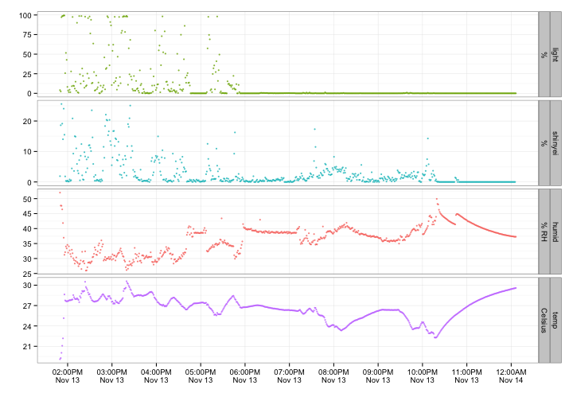

Kunming-PANDA-103
=================


After converting timestamps to local time, data looks like this.


```
##                 clock humid light shinyei temp
## 1 2012-11-13 13:49:41  52.0    42     1.9 19.1
## 2 2012-11-13 13:50:41  47.7    24    18.6 19.3
## 3 2012-11-13 13:51:41  47.6   994    25.6 20.0
## 4 2012-11-13 13:52:41  46.4  1008    19.1 21.1
## 5 2012-11-13 13:53:41  41.9  1010    14.0 22.2
## 6 2012-11-13 13:54:41  37.0  1018    24.0 25.1
```


Time series plot.

 

